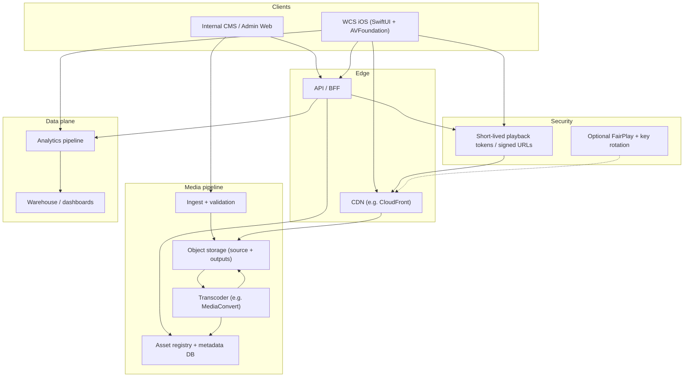
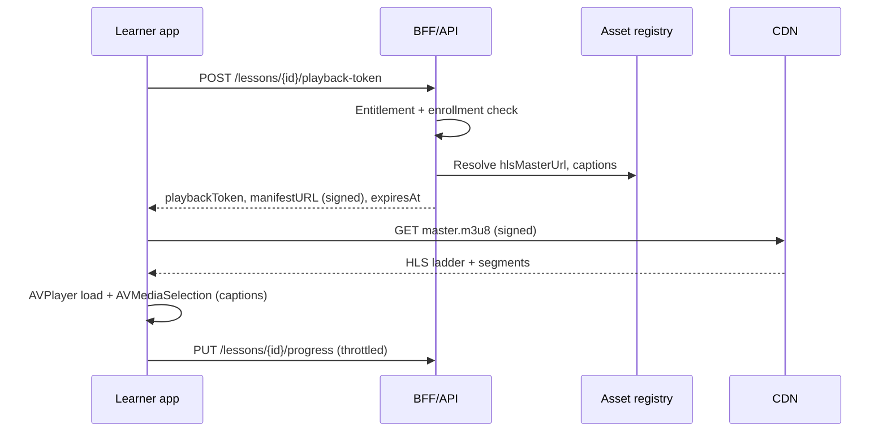
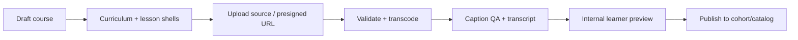

# WCS Video Learning Operating System — Implementation Specification

**Version:** 1.0  
**Audience:** iOS, backend, and content-ops engineers  
**Scope:** Udemy-inspired *learning operations* (streaming, curriculum, progress, captions, offline, analytics) for a **curated WCS academy**, not a public instructor marketplace at launch.

Related repo docs: `docs/analytics-taxonomy.md`, `docs/Payments_Entitlement_Decision_Record.md`, `docs/mvp-scope-lock.md`.

---

## 1. Executive summary

WCS ships a **mobile-first learning OS** built on **HLS VOD**, **AVPlayer**, **WebVTT captions**, **signed playback access**, optional **FairPlay** for premium/offline, and an **internal CMS** for staff-approved programs. Learners get resume playback, speed/quality controls, curriculum navigation, reflection/resources/discussion hooks, and (phased) offline downloads. Staff manage ingest, encoding status, captions, publish gates, and cohort links.

---

## 2. System architecture

### 2.1 Logical components



### 2.2 Playback path (streaming)



### 2.3 Offline path (HLS download)

```mermaid
sequenceDiagram
  participant L as Learner app
  participant API as API
  participant CDN as CDN

  L->>API: POST /downloads/licenses
  API-->>L: offlineAllowed, licenseExpiresAt, assetDescriptor
  L->>L: AVAssetDownloadURLSession queue
  L->>CDN: Fetch HLS (entitled variant)
  Note over L: Store in app sandbox; optional FairPlay CKC
  L->>API: Playback events (offline_start, offline_complete)
```

### 2.4 Publish path (staff)



---

## 3. iOS / Swift module breakdown

Layer **SwiftUI features** over a small **media core** that owns `AVPlayer`, observers, and download sessions. Keep **domain types** (Course, Lesson, WatchProgress) in a shared module consumed by UI and sync services.

### 3.1 Suggested Xcode targets or SPM packages

| Module | Responsibility | Key types / boundaries |
|--------|----------------|----------------------|
| **WCSMediaCore** | `AVPlayer` lifecycle, time observers, rate/quality, error mapping, caption selection | `LessonPlayerController`, `PlayerSession`, `PlaybackError` |
| **WCSCurriculum** | Sections, lessons, completion UI, navigation | `CurriculumStore`, `LessonRow`, `CompletionBadge` |
| **WCSCoursePlayerFeature** | Lesson screen composition: chrome, curriculum sheet, resources strip | `CoursePlayerView`, `PlayerChromeViewModel` |
| **WCSTranscriptFeature** | Transcript list, search, jump-to-time | `TranscriptViewModel`, `TranscriptLine` |
| **WCSOfflineDownloads** | `AVAssetDownloadURLSession`, queue, storage meter, delete | `DownloadManager`, `DownloadTask` |
| **WCSEntitlements** | Decode server flags; gate UI (download, HD, DRM) | `EntitlementClient`, `LessonAccess` |
| **WCSAssignments** | Prompts, attachments, submit flows | `AssignmentDetailView`, `SubmissionClient` |
| **WCSDiscussionLinks** | Deep link into tab / thread from lesson | `DiscussionDeepLinkRouter` |
| **WCSAnalyticsClient** | Emit envelope per `docs/analytics-taxonomy.md` | `Analytics.track(_:)` |
| **WCSAdminTools** *(if in same app)* | Staff-only surfaces | Feature-flagged routes |

### 3.2 Suggested directory layout (under `WCS-Platform/`)

```text
Core/
  Media/
    LessonPlayerController.swift
    PlayerSession.swift
    DownloadManager.swift
  Learning/
    Models/ Course.swift, Lesson.swift, WatchProgress.swift
    Stores/ CurriculumStore.swift
Features/
  CoursePlayer/
    CoursePlayerView.swift
    PlayerChrome/
    Transcript/
  Offline/
  Assignments/
  Discussion/
```

**Dependency rule:** `CoursePlayerFeature` → `MediaCore` + `Curriculum` + `AnalyticsClient`; **avoid** `MediaCore` importing SwiftUI.

---

## 4. API schema (OpenAPI-style fragments)

Conventions: JSON bodies, `Authorization: Bearer`, ISO-8601 timestamps, `id` as UUID strings unless legacy ints.

### 4.1 `GET /courses`

**200**

```yaml
type: array
items:
  type: object
  required: [id, title, status, pricingModel]
  properties:
    id: { type: string, format: uuid }
    title: { type: string }
    subtitle: { type: string, nullable: true }
    status: { type: string, enum: [draft, published, archived] }
    pricingModel: { type: string, enum: [audit, paid, membership] }
    thumbnailUrl: { type: string, format: uri, nullable: true }
    progressPercent: { type: number, minimum: 0, maximum: 1, nullable: true }
```

### 4.2 `GET /courses/{courseId}/curriculum`

**200**

```yaml
type: object
required: [courseId, sections]
properties:
  courseId: { type: string, format: uuid }
  sections:
    type: array
    items:
      type: object
      required: [id, title, order, lessons]
      properties:
        id: { type: string, format: uuid }
        title: { type: string }
        order: { type: integer }
        lessons:
          type: array
          items:
            type: object
            required: [id, title, type, order, durationSeconds, required]
            properties:
              id: { type: string, format: uuid }
              title: { type: string }
              type:
                type: string
                enum: [video, reading, reflection, assignment, resource, quiz, discussion_link, creative_activity]
              order: { type: integer }
              durationSeconds: { type: integer, minimum: 0 }
              required: { type: boolean }
              completed: { type: boolean }
              discussionThreadId: { type: string, nullable: true }
```

### 4.3 `GET /lessons/{lessonId}`

**200** (video lesson example)

```yaml
type: object
required: [id, courseId, sectionId, title, type]
properties:
  id: { type: string, format: uuid }
  courseId: { type: string, format: uuid }
  sectionId: { type: string, format: uuid }
  title: { type: string }
  type: { type: string, enum: [video, reading, ...] }
  durationSeconds: { type: integer }
  video:
    type: object
    required: [assetId, drmEnabled, offlineAllowed, watchCompletionThreshold]
    properties:
      assetId: { type: string, format: uuid }
      drmEnabled: { type: boolean }
      offlineAllowed: { type: boolean }
      watchCompletionThreshold: { type: number, default: 0.9 }
      posterUrl: { type: string, format: uri, nullable: true }
      audioOnlyRenditionAvailable: { type: boolean, default: false }
  captionTracks:
    type: array
    items:
      type: object
      required: [language, label, vttPath]
      properties:
        language: { type: string, example: en }
        label: { type: string, example: English }
        vttPath: { type: string, description: "Relative path or asset key; resolved via playback token" }
  resources:
    type: array
    items: { $ref: "#/components/schemas/ResourceAttachment" }
```

### 4.4 `POST /lessons/{lessonId}/playback-token`

**Request** (optional body)

```yaml
type: object
properties:
  clientCapabilities:
    type: object
    properties:
      maxHeight: { type: integer, example: 1080 }
      offline: { type: boolean, default: false }
```

**200**

```yaml
type: object
required: [manifestUrl, expiresAt, token]
properties:
  manifestUrl: { type: string, format: uri, description: "Signed master.m3u8 or template URL" }
  expiresAt: { type: string, format: date-time }
  token: { type: string, description: "Opaque; may be query param on CDN" }
  captionBaseUrl: { type: string, format: uri, nullable: true }
```

**403** — not entitled  
**409** — asset not ready (encoding)

### 4.5 `PUT /lessons/{lessonId}/progress`

```yaml
type: object
required: [positionSeconds, watchedPercent]
properties:
  positionSeconds: { type: number, minimum: 0 }
  watchedPercent: { type: number, minimum: 0, maximum: 1 }
  completed: { type: boolean }
  clientEventId: { type: string, format: uuid, description: "Idempotency key" }
```

**204** No content

### 4.6 `GET /lessons/{lessonId}/transcript`

```yaml
type: object
required: [lines]
properties:
  lines:
    type: array
    items:
      type: object
      required: [startMs, endMs, text]
      properties:
        startMs: { type: integer }
        endMs: { type: integer }
        text: { type: string }
```

### 4.7 `POST /downloads/licenses`

```yaml
type: object
required: [lessonId, deviceId]
properties:
  lessonId: { type: string, format: uuid }
  deviceId: { type: string, description: "Vendor-stable device id" }
```

**200**

```yaml
type: object
required: [allowed, expiresAt]
properties:
  allowed: { type: boolean }
  expiresAt: { type: string, format: date-time, nullable: true }
  fairPlayRequired: { type: boolean, default: false }
  downloadPolicy:
    type: object
    properties:
      maxConcurrent: { type: integer, default: 2 }
      variantTag: { type: string, example: mobile_720p }
```

### 4.8 Admin: `POST /admin/assets/upload-url`

```yaml
type: object
required: [lessonId, fileName, contentType, byteSize]
properties:
  lessonId: { type: string, format: uuid }
  fileName: { type: string }
  contentType: { type: string, example: video/mp4 }
  byteSize: { type: integer, maximum: 5368709120 }
```

**200**

```yaml
type: object
required: [assetId, uploadUrl, headers]
properties:
  assetId: { type: string, format: uuid }
  uploadUrl: { type: string, format: uri }
  headers:
    type: object
    additionalProperties: { type: string }
```

### 4.9 Components: `ResourceAttachment`

```yaml
ResourceAttachment:
  type: object
  required: [id, title, kind, url]
  properties:
    id: { type: string, format: uuid }
    title: { type: string }
    kind: { type: string, enum: [pdf, link, image, worksheet] }
    url: { type: string, format: uri }
```

---

## 5. Data model (implementation-ready fields)

Aligns with your outline; add **versioning** for publish safety.

| Entity | Extra implementation notes |
|--------|----------------------------|
| **Course** | `contentVersion`, `publishedAt`, `cohortId?` |
| **Lesson** | `blocks[]` or typed payload per `type` |
| **VideoAsset** | `processingJobId`, `lastProcessedAt`, `hlsMasterKey`, `status` enum |
| **CaptionTrack** | `status`: `draft`, `review`, `published` |
| **WatchProgress** | unique `(userId, lessonId)`; server merges max position |
| **PlaybackEvent** | append-only; reference `analytics-taxonomy` names |

---

## 6. Analytics alignment

Emit client events consistent with `docs/analytics-taxonomy.md`, extended for this OS:

| Event | When |
|-------|------|
| `lesson_started` | First frame rendered or user tapped play |
| `video_playback_started` | AVPlayer `rate > 0` |
| `video_playback_failed` | Fatal player error |
| `caption_toggled` | On → include `language` |
| `transcript_searched` | Submit search (debounced server or local) |
| `download_started` / `download_completed` / `download_deleted` | Offline manager |
| `discussion_opened_from_lesson` | Deep link success |

Include envelope fields: `course_id`, `lesson_id`, `plan_tier`, `platform`, `app_version`.

---

## 7. Phased roadmap (execution order)

1. **Phase 1 — Foundation:** HLS outputs, playback token API, `AVPlayer` lesson UI, curriculum API, progress PUT, manual WebVTT, basic events.
2. **Phase 2 — Learning loop:** `AVAssetDownloadURLSession`, assignments + resources, discussion deep links, certificates, transcript search.
3. **Phase 3 — Protection:** Token on every segment policy as needed, FairPlay, offline expiry, instructor analytics, storage lifecycle.
4. **Phase 4 — WCS intelligence:** Reviewed auto-captions, chapter markers, reflection prompts from transcript segments, facilitator dashboard.

---

## 8. Definition of done (MVP video OS)

- Staff path: course shell → upload → encode success → caption attach → publish.
- Learner path: stream HLS with captions + speed + resume + curriculum list.
- At least one flagship course: **offline lesson** download where `offlineAllowed`.
- Progress and completion drive **next lesson** and catalog **resume** surfaces.
- Analytics: playback + completion + caption/download/discussion signals live in taxonomy.

---

## 9. Risks (short)

| Risk | Mitigation |
|------|------------|
| Transcoder cost | Curated catalog + lifecycle rules on source mezzanine |
| Caption trust in care content | Human review state before `published` |
| TabView/ScrollView gesture conflicts in player | Isolate player in full-screen / dedicated container |
| Spec drift | Version this doc; link PRDs to `contentVersion` on Course |

---

*End of specification.*
